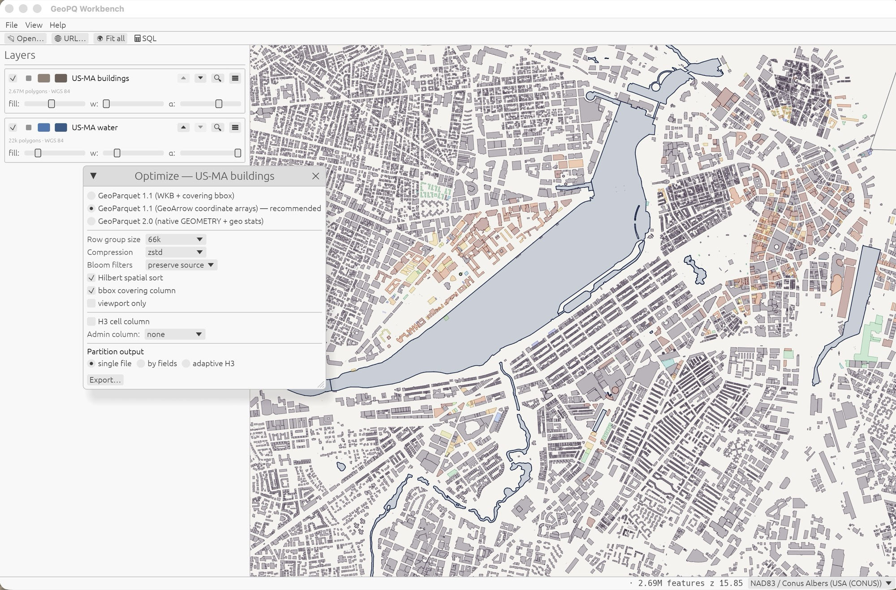

<p align="center"></p>

# GeoPQ Workbench

**Open, inspect, fix and query GeoParquet. A fast native desktop app, no
server, no GDAL.**

GeoPQ Workbench is a desktop application (Rust, egui + wgpu) for working
with GeoParquet at any size. It renders millions of features at
interactive frame rates, tells you exactly why a file is slow, rewrites
it into a fast one, and lets you query everything in SQL. It opens local
files, plain HTTPS URLs, S3 buckets, and whole catalogs like Overture
Maps.

It is also opinionated on purpose: most GeoParquet in the wild is a raw
database export that performs far below what the format allows. The
workbench shows you what your file is missing and fixes it in one click,
so it doubles as a hands-on guide to GeoParquet best practices.



## Highlights

- **Fast**: 3.75M points load in ~180 ms and pan/zoom at vsync. Memory
  scales with what is on screen, not with file size; attributes stay on
  disk until you click a feature.
- **Opens everything GeoParquet**: versions 1.0, 1.1 (WKB and GeoArrow
  coordinate arrays), 2.0 with native GEOMETRY types, files with no geo
  metadata at all, even bare tables with lon/lat columns.
- **Quality scorecard**: every file is graded at open (spatial index,
  spatial ordering, row groups, encoding, compression, metadata). Green
  means fast; anything else comes with an explanation.
- **One-click Optimize**: rewrite any layer as a best-practice
  GeoParquet (spatially sorted, indexed, zstd), in your choice of 1.1
  WKB, 1.1 GeoArrow, or 2.0 native, with optional H3 / admin-boundary
  columns and partitioned output — saved locally or published straight
  to S3 / R2, ready to open in place from its `s3://` URI.
- **Remote-native**: open `https://` and `s3://` files in place over
  range requests — or a whole `s3://bucket/prefix/` of hive-partitioned
  parts as one layer. A 304 MB file opens in ~1.3 s; only the row
  groups under your viewport are downloaded.
- **Catalog browser**: Overture Maps and Geomermaids Parquetry are
  preconfigured; check the layers you want and they load straight onto
  the map.
- **SQL console**: DataFusion with 24 spatial functions (including
  `st_transform` reprojection) over every loaded layer, local or
  remote, with spatial predicate pushdown and persistent query
  history. Results can be highlighted on the map or exported as new
  layers.
- **Cartography that defaults well**: automatic equal-area projection
  choice per dataset, ~30 official national grids, data-driven styling
  with six ramps, seven classification methods and an interactive
  legend, basemaps.
- **Grid summaries**: aggregate any numeric column onto square, H3 or A5
  cells with proper areal apportionment, smooth it, run focal operators
  (std, open/close, hillshade) over it, and get the cells or contour
  lines back as a new GeoParquet layer. 2.56M parcels to a 1 km grid in
  ~0.7 s.
- **No barriers to entry**: built-in sample datasets and a pure-Rust
  importer for GeoPackage, Shapefile and GeoJSON (no GDAL) if your data
  is not in GeoParquet yet.

## Install

Prebuilt binaries for all four desktop targets are on the
[GitHub Releases](https://github.com/gsueur/geopq-workbench/releases) page,
each with a SHA-256 checksum. No installer, no runtime dependencies.

| Platform | Download |
|---|---|
| macOS Apple Silicon | `geopq-workbench-<version>-aarch64-apple-darwin.dmg` |
| macOS Intel | `geopq-workbench-<version>-x86_64-apple-darwin.dmg` |
| Linux x86_64 | `geopq-workbench-<version>-x86_64-unknown-linux-gnu.tar.gz` |
| Windows x86_64 | `geopq-workbench-<version>-x86_64-pc-windows-msvc.zip` |

### macOS

Open the DMG, drag **GeoPQ Workbench** to Applications, launch. The
app is signed and notarized — no security prompts, no terminal
required. (A `.tar.gz` with the bare signed binary also exists for
scripted installs.)

### Windows

Unzip (right-click → Extract All, or `Expand-Archive` in PowerShell) and
run `geopq-workbench.exe`. SmartScreen will warn about an unrecognized
app the first time: click **More info → Run anyway**. If the window opens
blank or not at all, update your GPU driver — the renderer needs a
working Direct3D 12 or Vulkan stack.

### Linux

```bash
tar xzf geopq-workbench-v0.2.0-x86_64-unknown-linux-gnu.tar.gz
cd geopq-workbench-v0.2.0-x86_64-unknown-linux-gnu
./geopq-workbench
```

Needs a Wayland or X11 session and Vulkan drivers (`mesa-vulkan-drivers`
on Debian/Ubuntu). File dialogs go through the XDG desktop portal —
present on any mainstream desktop, may need
`xdg-desktop-portal-gtk`/`-kde` on minimal setups. The binary is built on
Ubuntu 22.04, so it runs on distributions with glibc 2.35 or newer; for
older ones, build from source.

### Verify a download

```bash
shasum -a 256 -c geopq-workbench-<version>-<target>.tar.gz.sha256
```

### Build from source

Any platform with stable Rust:

```bash
git clone https://github.com/gsueur/geopq-workbench
cd geopq-workbench
cargo build --release   # binary in target/release/geopq-workbench
```

## Quick start

1. **Launch it.** Nothing to configure.
2. **Get data on the map.** Drag & drop `.parquet` files or a dataset
   folder onto the window, or use File → Open… / Open folder… / Open
   URL… No GeoParquet at hand? **File → Open sample dataset** streams
   small hosted samples, and **File → Import vector file…** converts a
   GeoPackage table, a Shapefile or a GeoJSON file on the spot.
3. **Click around.** Click any feature for its attributes (fetched from
   the file on demand, nothing preloaded). The status bar shows
   coordinates, zoom, frame time and load progress.
4. **Open the file info** (layer ℹ button) to see the quality scorecard:
   what the file does well, what it is missing, and what that costs you.
5. **If a big unoptimized file pauses at a dialog**, that is the quality
   gate: choose **Optimize** (recommended: rewrites the file properly,
   then opens the fast copy) or **Load all** (QGIS-style full decode,
   slower but complete; remembered per file).

The app also takes paths and URLs as command-line arguments:

```bash
geopq-workbench file.parquet dataset_dir/ https://host/data.parquet
```

## Opening data

| Source | How |
|---|---|
| Local GeoParquet | drag & drop, File → Open…, or CLI argument |
| Multi-file / hive-partitioned dataset | File → Open folder… — the directory loads as a single layer; `key=value` path segments become queryable columns |
| HTTPS | File → Open URL… — needs range-request support on the server |
| S3 (`s3://bucket/key`) | File → Open URL… — profiles from `~/.aws`, custom endpoints (MinIO etc.), anonymous access to public buckets |
| S3 hive dataset (`s3://bucket/prefix/` or a `*` glob) | File → Open URL… — every matching parquet part loads as one layer (`s3://bucket/d/state=*/roads.parquet` picks one theme across partitions); `key=value` path segments become queryable columns |
| Catalogs (Overture Maps, Parquetry, your own) | File → Repositories… — browse snapshots, check layers, they load with sensible names and stacking order. Parquetry repos can load a theme across every state of a country as one layer, with `country`/`state` as columns |
| GeoPackage / Shapefile / GeoJSON | drag & drop or File → Import vector file… — pure-Rust conversion to GeoParquet (no GDAL), with a covering bbox column and byte-sized row groups so the result is readable by viewport from the first open, then opens normally |
| Sample data | File → Open sample dataset |

Format-wise, anything in the GeoParquet family works: 1.0, 1.1 with WKB
or GeoArrow coordinate arrays, 2.0 with native GEOMETRY/GEOGRAPHY
logical types (including files whose CRS lives only in the logical
type, with no `geo` metadata at all), plus untagged parquet with a
guessable geometry column, and tables with only lon/lat (or x/y)
columns, which load as point layers directly. Mixed CRS across layers
is fine; everything reprojects onto one map. Data declared with
`edges: spherical` (or a GEOGRAPHY column) gets its long segments
densified along great circles before projection, so spherical edges
render as the curves they are.

One tip for very large remote files: zoom to your area of interest
before or right after opening. The viewport drives what gets
downloaded, and a whole-world view of a country-sized file legitimately
wants every row group.

## Understanding a file

- **Quality scorecard** (layer ℹ → File info): seven checks run against
  the parquet footer alone, before any data is read. The three gating
  ones: is there a spatial index (bbox covering column, native geo
  statistics, or coordinate statistics)? is the file spatially ordered
  (row-group bbox overlap)? are the row groups a sensible size? Plus
  advisory checks on encoding, page index, compression and metadata
  hygiene. Each line explains itself.
- **Row-group bboxes on the map** (per-layer checkbox): draws each row
  group's spatial extent, so you can *see* clustering. A well-sorted
  file shows a neat mosaic; a raw export shows every box covering the
  whole extent, which is exactly why it cannot be displayed
  incrementally.
- **File info** also lists version, encoding, CRS, per-column types and
  compression, row-group layout, and the raw `geo` metadata JSON.
- **The quality gate**: files that fail the gating checks and are too
  big to just decode (over ~2.5M rows) pause at a dialog instead of
  silently rendering a decimated view that can never refine. You choose:
  Optimize now, or load everything the slow way. Your choice is
  remembered per file in `~/.geopq-workbench.json`.

The full policy is written up in
[docs/OPEN_POLICY.md](docs/OPEN_POLICY.md).

## Making files fast

Per-layer **Export…** rewrites any loaded file (local or remote) as a
best-practice GeoParquet: features sorted along a Hilbert curve, tuned
row groups, zstd compression at the level the
[GeoParquet distribution guidance](https://github.com/opengeospatial/geoparquet/blob/main/format-specs/distributing-geoparquet.md)
recommends, page indexes, bloom filters. Three output flavors:

- **GeoParquet 1.1 (WKB + bbox column)**: opens everywhere, and the
  bbox covering column gives readers per-feature spatial selection.
  The safe choice for files that travel.
- **GeoParquet 1.1 (GeoArrow)**: geometry as raw coordinate arrays,
  the fastest to decode and display; needs a single geometry family
  (Polygon promotes into MultiPolygon and so on). Recommended by the
  dialog whenever your data fits it.
- **GeoParquet 2.0 (native GEOMETRY)**: the new Parquet-native
  geospatial type with built-in statistics; picking it applies the
  official recommended settings. Two optional extras: keep the bbox
  column (page-level spatial pruning, and the cheapest exact viewport
  selection — without it the workbench falls back to scanning WKB
  envelopes) and/or add an auxiliary GeoArrow column so GeoArrow-aware
  readers get the fast decode path from a fully conformant 2.0 file.

Beyond the rewrite itself:

- **Viewport only**: export just the features intersecting the current
  view.
- **Merge with…**: fold other loaded layers into the export — schemas
  union by column name, geometries reproject into the primary layer's
  CRS, and an optional `source_layer` column records provenance. Merge
  three regional files into one optimized national one, straight from
  the dialog.
- **Derived columns**: an H3 cell column at your chosen resolution, and
  admin attribution (state, county, …) from any loaded boundary layer.
- **Partitioned output**: hive directories by chosen fields
  (`state=MA/part-0.parquet`) or adaptive H3 cells that split until each
  file is under a row target. Every part keeps the full treatment.
- **Publish to S3 / R2**: tick "Publish to S3 / R2" in the Export
  dialog and the output uploads to your bucket (multipart for big
  files) instead of staying local; partitioned datasets upload under a
  prefix that the workbench can reopen as one layer. Already-optimized
  local files can upload as-is, skipping the rewrite. Needs write
  credentials in `~/.aws` (for R2: an API token plus the account
  endpoint).
- **Before/after report**: size, row groups, and a spatial-clustering
  metric, with a button to load the result directly — including
  published outputs, which reload straight from the bucket. A
  1.89M-parcel cadastral file rewrites in ~7 s.

The optimizer holds the dataset in memory (capped at 8 GB uncompressed);
larger files are on the roadmap.

## Exploring the map

- **Projections**: the first layer picks a sensible display projection
  automatically — projected data keeps its own CRS, geographic data gets
  an equal-area choice fitted to its extent (Albers, azimuthal, or
  cylindrical), a curated table of ~30 official national grids takes
  precedence (France displays in Lambert-93, UK in British National
  Grid, CONUS in EPSG:5070), and world-scale data uses Hobo–Dyer. Or
  pick any projection / EPSG code in the status bar; layers re-project
  in the background.
- **Styling**: fill, border and point colors with sensible auto-derived
  defaults, opacity, line width, point radius; fill and border switch
  off independently from the `fill:` / `w:` labels in the layer row, so
  you can draw outlines only or fills only. **Style by value** colors by any
  attribute: numeric columns get six ramps and seven classification
  methods (equal interval, quantile, half-std-dev, Jenks, arithmetic and
  geometric progression, head/tail breaks) with your choice of class
  count up to 16; text columns get a categorical palette of the most
  frequent values, or the dataset's own published palette when there is
  one — CORINE Land Cover styles itself in its 47 official colours and
  class names, and any QGIS colour-map export can be loaded for the
  rest. **Normalize by area** divides each value by its
  feature's area before classifying and drawing, so absolute totals stop
  tracking polygon size (the legend then reads `LAND_VAL / m²`, in the
  CRS's own unit). Geographic layers are measured on an equal-area
  projection rather than in degrees², which are not an area: without
  that, two identical fields would rank differently for no reason but
  how far north they sit.
- **Legend**: class bounds under the layer, rounded to three significant
  digits with k/M suffixes, swatches composited exactly as the map draws
  them at the current fill opacity. Click a class to hide it on the map;
  ⟳ reclassifies from what is currently in the viewport, so a
  state-wide ramp can be refitted to one county without touching the
  file.
- **Rename** (layer ⋮ → Rename): a display label for the layer panel and
  legend; the file keeps its name.
- **Basemaps**: Carto Light/Dark/Voyager and OSM raster tiles, each
  Carto style also in a label-free variant, plus a Natural Earth
  coastline and graticule that follow any projection. The coastline is
  zoom-dependent: the embedded 1:50m version is swapped for the 1:10m
  one when you zoom in (fetched once, ~3 MB, cached on disk; the app
  quietly stays on 1:50m offline).
- **Tiles outside Mercator**: tiles are published in Web Mercator, so
  in any other display projection each one is drawn as a subdivided
  mesh with its vertices projected exactly. Geometry reprojects
  cleanly; the place names rendered into the pixels do not, since they
  shear with the raster carrying them. So a labelled source switches to
  its label-free twin once the view deforms enough to show, and at
  world scale tiles are dropped altogether, where Mercator's ±85° cut
  would leave a blank cap over each pole and the coastline overlay is
  the better basemap.
- **Layer filters** (⋮ → Filter…): a persistent SQL predicate per layer;
  only matching rows are decoded, drawn, picked and queried until you
  clear it. Spatial predicates prune at the file level, so a location
  filter on a huge remote file only reads the relevant row groups.
- **Reload to viewport** (View menu): drop everything loaded and reload
  just the current view — reclaims memory after a continent-sized
  detour.
- **Attribution**: a layer that carries a credit shows it in the map
  corner beside the basemap's, and in full under File info. It is read
  from the parquet metadata (`attribution`, `license`, …) or from an
  `ATTRIBUTION.txt` beside the data, searched from the file's own folder
  upwards with the nearest notice winning — so one file at a
  repository's root credits everything under it (OpenStreetMap for the
  Parquetry mirror) while a dataset that needs its own can override it
  (geoBoundaries under CC BY).
- **Attributes on click**, fetched lazily from the file; a floating
  window that never resizes the map. Works identically on remote files
  (each click is a small ranged read, off the UI thread).
- **Session contexts**: File → Save context… stores layers (including
  remote URLs and S3 sources), styles, order, camera and projection as a
  JSON file; Load context… restores the whole session.

Large files never lock you out: views that would decode more than ~2.5M
rows, or more than a gigabyte of geometry, render as a live decimated
preview, and zooming in streams the real rows for your viewport in the
background. Both limits matter — 2.4M land-cover polygons sit under the
row budget while carrying 7 GB of coordinates.

## Querying with SQL

The SQL console (toolbar → SQL) runs DataFusion with 24 `ST_*` spatial
functions (measures, predicates, constructors, buffer / simplify /
convex hull / centroid, WKT in/out, `st_transform` reprojection) over
every loaded layer — local, HTTPS and S3 alike. Two modes,
TablePlus-style: **Browse** (pick a table, type a WHERE clause) and
**Query** (free-form SQL, Ctrl+Enter, with a persistent query history
on Ctrl+Up / Ctrl+Down).

```sql
select name, st_area(geometry) as m2
from buildings
where st_intersects(geometry, st_makeenvelope(-71.1, 42.3, -71.0, 42.4))
order by m2 desc limit 100;
```

Spatial predicates against literal geometries push down into the
parquet reads: row groups are pruned by their bboxes and rows by the
covering column, so the query above touches only the files' relevant
parts, then the exact predicate is re-applied. Results can highlight
features on the map, zoom to a feature, copy as TSV, or export back as
a regular layer (whole result or checked rows).

## Summarizing onto a grid

Layer ⋮ → **Grid summary…** aggregates a numeric column onto a regular
cell system and writes the result as a new GeoParquet layer, ready to
style, query or export like any other. Useful when the geometry gets in
the way of the pattern: parcels, buildings and admin units come in wildly
different sizes, and a choropleth of them mostly maps polygon size.

- **Cell systems**: square cells in the layer's own CRS at the size you
  choose, or H3 / A5 cells for equal-area coverage of the globe.
- **Areal apportionment**: a feature spanning several cells gives each
  cell the share of its value that the cell actually covers — exact
  rectangle clipping on square grids, sampling on H3/A5. Assigning by
  centroid instead would drop a 40 km² state forest's entire value onto
  one 1 km cell, and that artifact is precisely what a grid is supposed
  to remove.
- **Statistics**, split into rates (mean, median) and totals (sum,
  count, density). **Density** — apportioned total ÷ cell area — is the
  one to reach for on mixed-size polygons: the apportionment weights
  cancel out in mean and median, so under those a giant parcel still
  paints its own value across every cell it touches.
- **Smoothing**: any number of passes of a 3×3 box or Gaussian kernel
  (ring mean on H3/A5). Each pass averages present neighbors only, so
  nothing bleeds past the edge of the data.
- **Focal operations** on the smoothed surface, because a grid is an
  image by then: **focal std** (local heterogeneity — where values are
  mixed rather than where they are high), **open** and **close** (drop
  isolated hot cells, fill isolated holes, without moving the level
  around them), and **hillshade** on square grids, whose vertical
  exaggeration is fitted to the data so dollars or people light as
  readably as metres.
- **Contour lines**: square grids can output isolines instead of cell
  polygons, with levels at value quantiles (the default — equal steps
  put every line in the outlier tail on skewed data) or equal steps.

Output columns keep the source field name, so a mean of `LAND_VAL`
returns a `LAND_VAL` column and legends read correctly downstream.
Operations that change what the number means say so: focal std returns
`LAND_VAL_std`, hillshade returns `LAND_VAL_shade`.

On 2.56M MassGIS parcels: 1 km square grid in ~0.7 s, H3 r7 in ~8 s,
A5 r14 in ~16 s, contours in ~0.6 s.

## Performance notes

Measured on real datasets, release build:

- 3.75M points: ~180 ms load, vsync pan/zoom.
- 304 MB remote GeoParquet 2.0 (2.7M buildings): opens in ~1.3 s; a
  city-scale viewport (307k buildings, 6 of 53 row groups) renders
  after ~5 s of parallel range requests.
- Overture buildings on S3 (518 MB part): open ~2 s, ~10k buildings for
  a city viewport in ~8 s, anonymously.
- Memory is bounded by what is displayed (~12 bytes per point of GPU
  geometry), not by file size, and the row budget (~2.5M rows per load)
  keeps worst-case files from exhausting RAM.

## Under the hood

Pure-Rust stack end to end: parquet/arrow readers, proj4rs
reprojection, rayon + lyon tessellation, custom wgpu render pipelines
inside an egui shell. No GDAL, no web view, no server process.

| Module | Role |
|---|---|
| `data/loader.rs` | streaming reads, metadata, quality analysis, parallel geometry build |
| `data/store.rs` | lazy row access (attributes, geometry) over row-group/page selections |
| `data/source.rs` | local / HTTPS / S3 readers with windowed range requests |
| `data/optimize.rs` | the Optimize rewrite (Hilbert sort, covering, 1.1/2.0 flavors, partitioning) |
| `data/gpkg.rs`, `data/shp.rs`, `data/geojson.rs` | vector imports (bundled SQLite, pure-Rust shapefile, serde_json) over shared machinery in `data/import.rs` |
| `data/crs.rs` | PROJJSON → EPSG → proj4rs, projection selection |
| `data/grid.rs` | grid summaries: square/H3/A5 aggregation, areal apportionment, smoothing and focal operators, marching-squares contours |
| `map/` | wgpu pipelines, tiles, chunked f64-origin geometry for jitter-free deep zoom |
| `sql/` | DataFusion integration, ST_* UDFs, spatial pushdown, console UI |
| `app.rs` | the egui application |

Design notes live in [docs/OPEN_POLICY.md](docs/OPEN_POLICY.md) (file
quality gate and display policy).

## Roadmap

- Lazy part-append while panning across STAC collections. Parts are
  resolved once at open against the viewport and capped at 16, so a
  collection can report parts it will not go and fetch.
- More SQL: polygon set operations (union, intersection, difference)
  and spatial aggregates, so the console can produce a layer rather
  than only filter one.
- Attribute tables with no geometry, loaded as first-class sources:
  plain parquet first, then CSV with type inference. They would carry
  no map presence of their own, only columns to query and join against.
- Joins between an attribute table and a geo layer, keyed on a shared
  column, producing a styleable layer. This is the reason the two
  entries above are worth having.
- Line styling: dash patterns and caps, plus width driven by a
  classified column the way colour already is.
- Export the current view to SVG, for a figure that goes into a
  document rather than into another dataset.
- Streaming optimize beyond the 8 GB in-memory cap; multi-file
  optimize.
- Remote hive datasets over `https://` (the `s3://` side shipped in
  0.3.2). Blocked on discovery rather than on reading: `s3://prefix/`
  works because S3 lists objects, while plain HTTPS has no equivalent,
  so this needs a manifest convention first.
- Label rendering.

Zoom-dependent level of detail shipped in 0.5.0, by scale rather than
by data volume; the overview/pyramid approach it replaced was tried and
discarded. Basemap tiles now reproject onto a mesh instead of being
hidden outside Mercator, falling back to a label-free source once the
view would shear the place names baked into them.

## Development

```bash
cargo test          # 150+ tests, no fixtures needed for most
cargo run --release testdata/points_1m_wgs84.parquet
```

Test fixtures are generated, not committed: `./testdata/regenerate.sh`
rebuilds them with the DuckDB CLI (fixture-dependent tests self-skip
when absent). CI runs the suite on Linux, macOS and Windows, including
GPU render tests on a software rasterizer. Releases are tag-driven:
bump the version in `Cargo.toml`, tag `vX.Y.Z`, push the tag, and the
workflow builds and publishes all four platform archives with
checksums.

## Credits

GeoPQ Workbench is created by [Geomermaids](https://www.geomermaids.com).

## License

MIT OR Apache-2.0, at your option. Copyright Guillaume Sueur,
Geomermaids.
